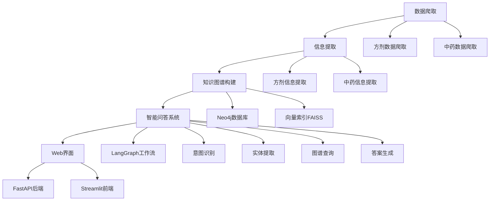
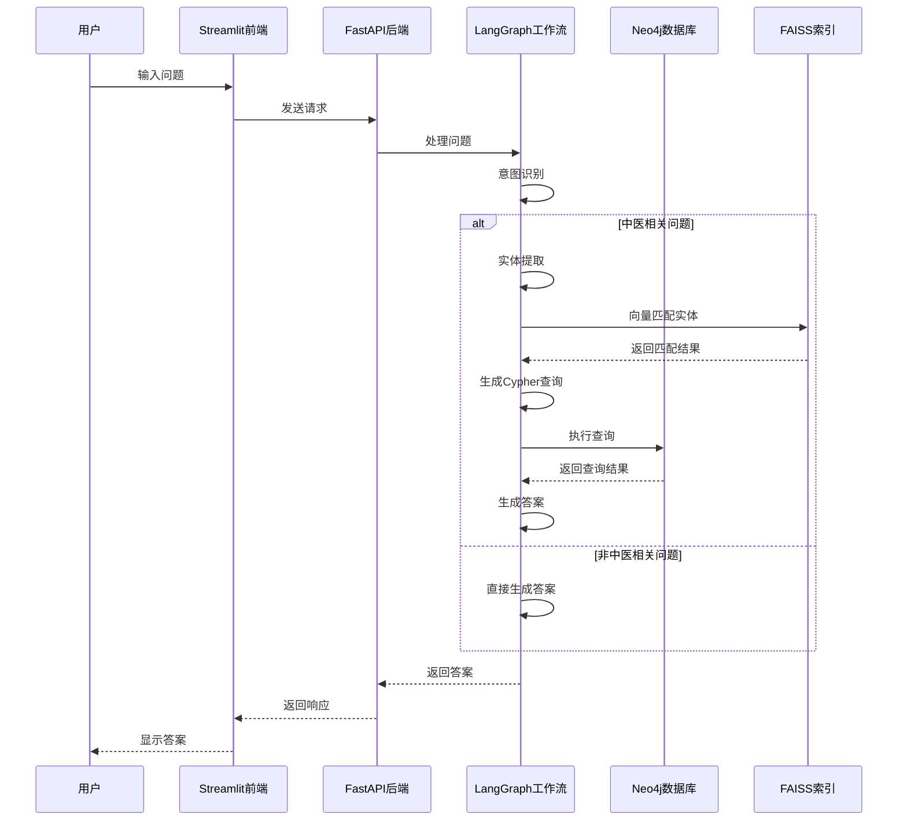

# 中医药知识图谱项目

## 项目简介

本项目是一个基于知识图谱的中医药智能问答系统，通过爬取中医药相关数据，构建中医药知识图谱，并提供智能问答服务。项目整合了现代AI技术与传统中医药知识，为用户提供专业的中医药知识查询和解答服务。

## 项目架构



## 技术栈

- **后端框架**: FastAPI
- **前端框架**: Streamlit
- **知识图谱**: Neo4j
- **向量检索**: FAISS
- **工作流引擎**: LangGraph
- **大语言模型**: LangChain + OpenAI API
- **数据爬取**: BeautifulSoup + Requests
- **数据处理**: Pandas
- **向量嵌入**: Sentence-Transformers

## 项目结构

```
medical_KG_project/
├── __001__clawer/                 # 数据爬取模块
│   ├── 中药/                      # 中药数据文件
│   ├── 方剂/                      # 方剂数据文件
│   ├── __001__spider_zhongyibaike_fangji.py    # 方剂列表爬虫
│   ├── __002__spider_zhongyibaike_fangji_detail.py  # 方剂详情爬虫
│   ├── __003__get_herb_menu_list.py             # 中药列表爬虫
│   └── __004__get_herb_detail_list.py           # 中药详情爬虫
├── __002__extract_information/      # 信息提取模块
│   ├── __000__extract_graph_data_utils.py      # 提取工具
│   ├── __001__extract_formula.py               # 方剂信息提取
│   └── __002__extract_herb.py                  # 中药信息提取
├── __003__create_neo4j_database/   # 知识图谱构建模块
│   ├── __001__import_to_neo4j.py               # 导入Neo4j
│   ├── __002__export_metadata.py               # 导出元数据
│   ├── __003__faiss_embedding.py               # 构建向量索引
│   └── __004__faiss_search_test.py             # 向量检索测试
├── __004__langgraph_more_nodes/    # 智能问答工作流
│   ├── nodes/                       # 工作流节点
│   │   ├── zhongyi_intent_node.py              # 中医意图识别
│   │   ├── extract_entity_from_user_input_node.py  # 实体提取
│   │   ├── match_entity_from_neo4j_node.py     # 实体匹配
│   │   ├── generate_neo4j_cypher_node.py       # 生成查询语句
│   │   ├── check_cypher_node.py                # 检查查询语句
│   │   ├── run_cypher_node.py                  # 执行查询
│   │   └── neo4j_answer_generate_node.py        # 生成答案
│   ├── agent_state.py              # 工作流状态定义
│   └── langgraph_more_nodes.py     # 工作流构建
├── __005__fastapi/                 # FastAPI服务
│   ├── __001__fastapi.py           # API服务器
│   └── __002__fastapi_client.py    # API客户端
├── __006__streamlit/               # Streamlit前端
│   ├── __001__chat_app.py          # 聊天应用
│   └── __002__chat_app_run.py      # 启动脚本
└── common/                         # 公共模块
    ├── config.py                   # 配置管理
    ├── embedding_model.py          # 嵌入模型
    ├── llm.py                      # 大语言模型
    ├── neo4j_manager.py            # Neo4j管理
    ├── ouput_graph_utils.py        # 图输出工具
    └── path_utils.py               # 路径工具
```

## 安装指南

### 环境要求

- Python 3.8+
- Neo4j 数据库
- 足够的磁盘空间存储数据和模型

### 安装步骤

1. 克隆项目
   
   ```bash
   git clone [项目地址]
   cd medical_KG_project
   ```

2. 安装依赖
   
   ```bash
   pip install -r requirements.txt
   ```

3. 配置环境变量
   创建 `.env` 文件，配置以下变量：
   
   ```
   MODEL_API_KEY=你的模型API密钥
   MODEL_BASE_URL=你的模型API基础URL
   MODEL_NAME=你的模型名称
   NEO4J_URI=你的Neo4j数据库URI
   NEO4J_USER=你的Neo4j用户名
   NEO4J_PASSWORD=你的Neo4j密码
   EMBEDDING_MODEL_PATH=你的嵌入模型路径
   ```

4. 启动Neo4j数据库
   确保Neo4j数据库已安装并运行，并创建相应的数据库。

## 使用指南

### 1. 数据爬取

爬取中医药数据：

```bash
# 爬取方剂列表
python __001__clawer/__001__spider_zhongyibaike_fangji.py

# 爬取方剂详情
python __001__clawer/__002__spider_zhongyibaike_fangji_detail.py

# 爬取中药列表
python __001__clawer/__003__get_herb_menu_list.py

# 爬取中药详情
python __001__clawer/__004__get_herb_detail_list.py
```

### 2. 信息提取

从爬取的数据中提取结构化信息：

```bash
# 提取方剂信息
python __002__extract_information/__001__extract_formula.py

# 提取中药信息
python __002__extract_information/__002__extract_herb.py
```

### 3. 构建知识图谱

将提取的信息导入Neo4j并构建向量索引：

```bash
# 导入Neo4j数据库
python __003__create_neo4j_database/__001__import_to_neo4j.py

# 导出元数据
python __003__create_neo4j_database/__002__export_metadata.py

# 构建向量索引
python __003__create_neo4j_database/__003__faiss_embedding.py

# 测试向量检索
python __003__create_neo4j_database/__004__faiss_search_test.py
```

### 4. 启动服务

启动FastAPI后端服务：

```bash
python __005__fastapi/__001__fastapi.py
```

启动Streamlit前端应用：

```bash
streamlit run __006__streamlit/__001__chat_app.py
```

或者使用便捷启动脚本：

```bash
python __006__streamlit/__002__chat_app_run.py
```

## 功能特点

1. **全面的数据采集**：爬取中医百科网站，获取中药和方剂的详细信息
2. **智能信息提取**：利用大语言模型从非结构化文本中提取结构化信息
3. **知识图谱构建**：将提取的信息存储到Neo4j图数据库，构建中医药知识图谱
4. **智能问答系统**：基于LangGraph构建多节点工作流，实现智能问答
5. **向量检索**：结合FAISS向量索引，提高实体匹配和查询效率
6. **用户友好界面**：提供Streamlit构建的Web界面，方便用户交互

## 系统工作流程



## 贡献指南

欢迎提交Issue和Pull Request来改进项目。在提交代码前，请确保：

1. 代码符合项目的编码规范
2. 添加必要的测试
3. 更新相关文档

## 许可证

本项目采用MIT许可证，详见LICENSE文件。

## 联系方式

如有问题或建议，请通过以下方式联系：

- 提交Issue
- 发送邮件至：cvr2941019995@163.com

## 致谢

感谢以下开源项目和资源：

- [Neo4j](https://neo4j.com/) - 图数据库
- [LangChain](https://langchain.com/) - LLM应用框架
- [LangGraph](https://langchain-ai.github.io/langgraph/) - 工作流框架
- [FastAPI](https://fastapi.tiangolo.com/) - Web框架
- [Streamlit](https://streamlit.io/) - 数据应用框架
- [FAISS](https://faiss.ai/) - 向量检索库
- [中医百科](https://zhongyibaike.com/) - 数据来源
